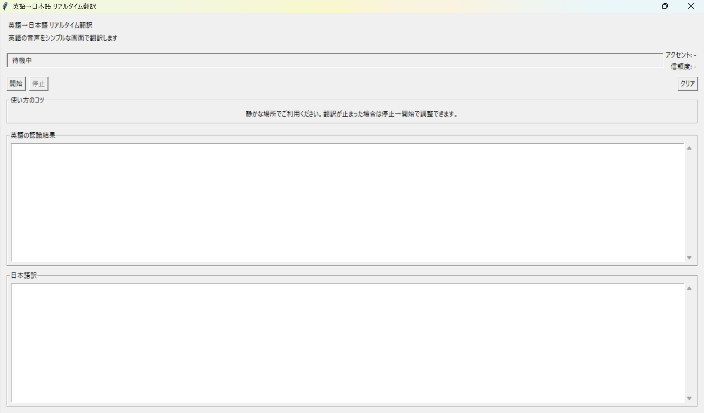

# 英日リアルタイム翻訳アプリ

マイクで受け取った英語を文字起こしし、日本語に翻訳するデスクトップアプリです。Google Cloud Translation の認証情報があれば公式 API を使い、設定がなければ自動で `googletrans` に切り替わります。

## 必要なもの

- Python 3.10 以上
- マイク入力とインターネット接続

## セットアップ

```bash
python -m venv .venv
source .venv/bin/activate  # Windows: .venv\Scripts\activate
pip install -r requirements.txt
```

### 翻訳 API を使う場合

Google Cloud で Translation API を有効化し、サービスアカウントキーを `GOOGLE_APPLICATION_CREDENTIALS` または `GOOGLE_API_KEY` で指定してください。設定済みなら追加のコード変更は不要です。

## 使い方

```bash
python app.py
```

1. 「開始」で録音を始めます。
2. 発話が終わると英語→日本語の結果が表示されます。
3. 止めるときは「停止」を押してください。

## 画面イメージ


